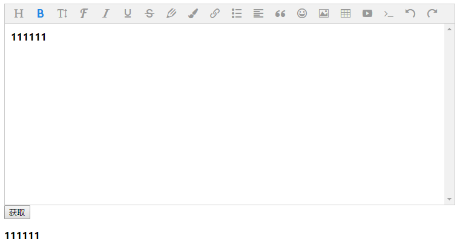

> 该项目功能基础源码来自于 [wangEditor](https://github.com/wangfupeng1988/wangEditor) 本项目主要是因为原项目使用 `gulp` 打包并且由于依赖版本问题，无法打包，且因为需求需要添加新的功能，故此更新此项目。

### 主要改动

- 将原项目的打包方式更换为 `rollup`

- 优化部分代码

- 新增图片链接功能

### Todo

后续更新内容

- [ ] 图片大小调整
- [ ] 字体功能
- [ ] ....

### 用法

```shell
npm i jsy-editor --save
```

```shell
yarn add jsy-editor --save
```

> `js` 部分参考 `wangeditor`, 需要注意的是，由于更换了打包方式，原先不需要引入 `css` 。现在需要手动引入 `lib` 文件夹下面的 `index.min.css`

```html
<div id="div"></div>
```

```js
import 'jsy-editor/lib/index.min.css'
import Editor from 'jsy-editor'

const E = new Editor('#div')

/*
 * do something 添加 配置
 */

E.create() // 创建富文本实例
```

#### 运行效果


